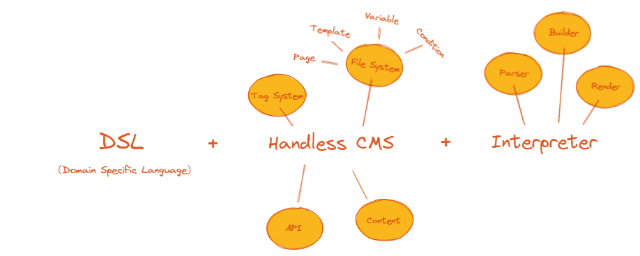
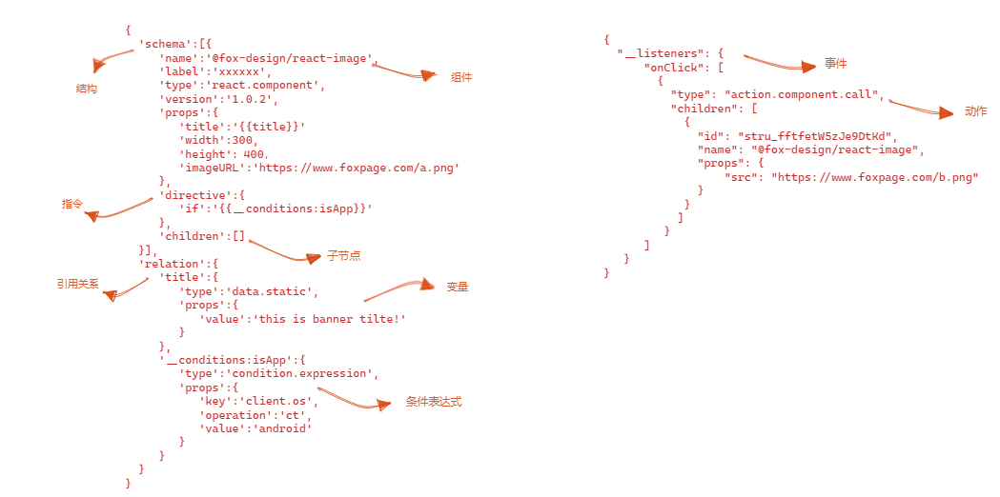
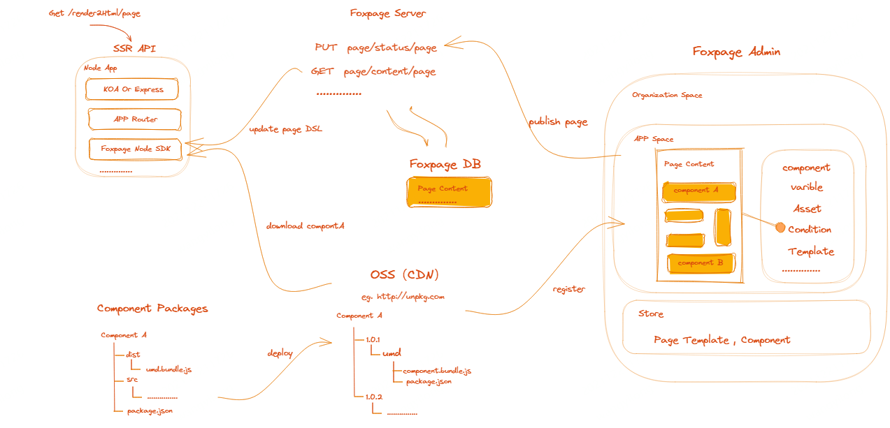
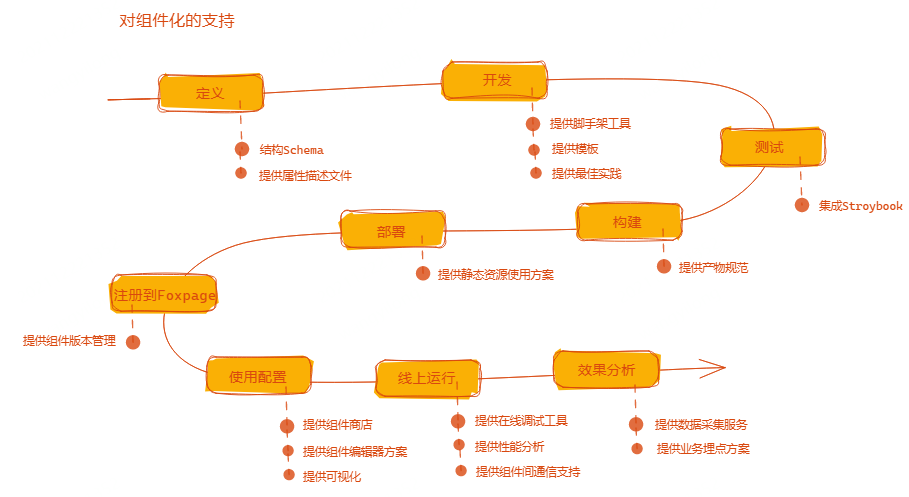
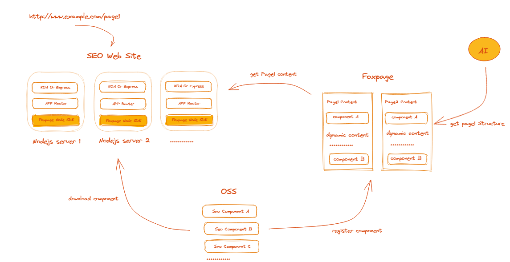
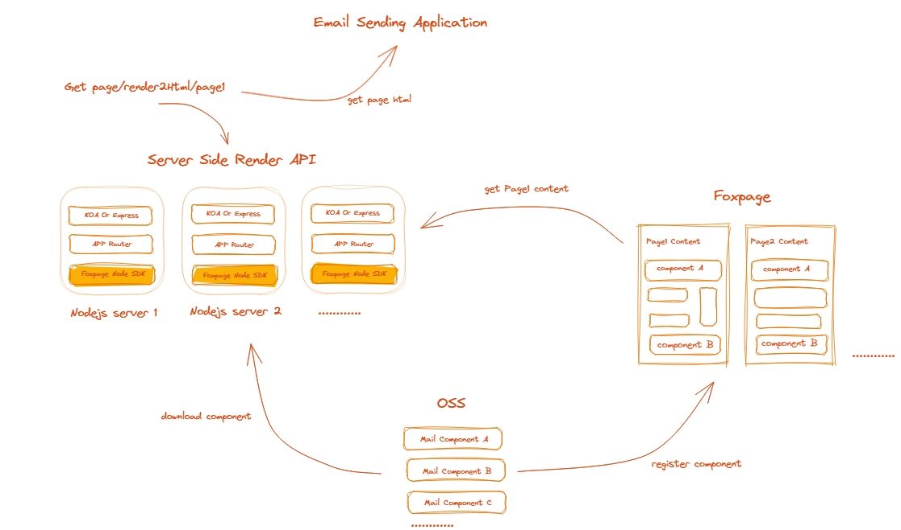

## Foxpage 前端低代码框架正式开源！

由 Trip.com 技术团队精心打造，历经内部多个项目的打磨锤炼。于 2021 年 6 月正式立项开源，经过开发工程师们夜以继日，“前赴后继”的努力，开源版本终于和大家见面了！目前项目代码已经提交至[Github.com](https://github.com/foxpage) 上，有兴趣的小伙伴可以上去看看，别忘了上颗星哦^\_^！

### 前言

随着低代码的开发方式被越来越多的人接受和认可，使得低代码得到了蓬勃的发展，更被寄希望成为 IT 行业革命性的“新生产力”。据有关报道全球低代码类产品市场规模在 2020 年已经达到 80 多亿美元，预计 2021 超过百亿美元。而中国市场将给整个市场带来增量，这其中前端又是其中最重要的一环。同时低代码类产品也如雨后春笋一样层出不穷，百家争鸣。但看似繁荣的背后却暗藏隐患

#### 低代码行业现状

**国外的有：** Salesforece，Microsoft，OutSystems，Mendix 等，这些都是处于领导者的地位的资深玩家。产品功能强大，流程完善，生态健全

**国内的有：** 钉钉宜搭，明道云，织信，奥哲，简道云等，这些国内的方案大都是结合某个场景提供的支持方案，还处于发展阶段

**开源的有：** Odoo Studio，Frappe，Steedos Platform

当然还有些玩家只在企业内部发展并未公开。各类玩家众多，各有优势，关注的方向也有差异。有的是结合某个行业定制，有的是结合单个使用场景深耕，还有的执着于提供应用开发的完整低代码方案。大部分提供的是 SaaS 产品，其中部分会提供私有化部署方案

当前低代码行业发展整体还处在战国的诸侯割据，各自封王时期。别说一统就连三分之势都还远未形成，所以乾坤未定，谁都可能是黑马

#### 行业之殇

按照道理来说低代码众多的产品功能已经足够强大了，功能相对完善。但是企业内部却还在自研着各类低代码产品，在企业里不同业务线可能存在多个低代码类的产品，甚至在同一个业务线的不同使用场景或不同的技术栈也都有不同的低码类产品，各自都有一套实现的方案，大都是围绕自身业务需求定制的，自成一脉

据不可靠消息，某福报厂内部的低代码类系统或工具高达上百个。。。上百个。。。。上百个？（听到时惊呆了），其他厂内部也不少。做的好点的大都会出来露个脸，那些未露脸真不知道有多少。大企业有技术也有钱任性也就算了，可中小企业或团队也都开始有此趋势了，“想想也是毕竟没什么门槛嘛，人人都可以做”

我相信大部分团队在选择自建之前还是做过充分的调研的，但最终还是各种理由放弃了直接使用成熟的产品。而当时大家可能对低代码还一知半解，甚至有可能都没听说过。为了快速满足业务需求，就一头扎进低代码产品开发中去。其实这些系统或工具的核心功能和能力大体是相似的，技术上看大家最终的实现方案和体验上都会趋于相近或相同，自研的整个过程会有大量的重复性的工作，造成了大量的人力资源的浪费。从行业发展的角度来看感觉已经开始内卷了

为什么会造成这样的局面？大家的本意可能都是想借助低代码方案来解决业务问题，重心还是在满足业务问题上。但却发现行业基建太差，借助成品的方案也难以落地。只能一遍遍的重复着低代码的基础能力和设施的建设，乐此不疲也无奈地重复地造着轮子

先行者们是否都太过于强调低代码开发，却忘了教大家怎么做才能够低代码开发？在忙着跑马圈地的同时是否可以关注下对行业的建设？而不是只顾着建什么闭环，什么生态，造出了一座又一座大小不一的孤岛。行业的发展要有引导，沉淀和积累。一个健康的发展态势理应像一棵树，虽然分支很多，但是有主干，有方向，有支撑，会开花能结果。而现当下的发展态势更像“爬山虎”，表面郁郁葱葱，内部却无序，毫无章法，抓到个着力点就开始豪取强夺，野蛮生长，不成体系

#### 低代码基础建设

整理了一些市面上成熟产品可能存在的问题：

- 功能臃肿，系统复杂。对接入和二次开发成本都较高
- 不够开放，定制化程度高。部分的产品还有技术栈的约束
- 场景支持单一，扩展较难。对一些碎片化的场景支持也不友好

这些问题也许是导致开发者弃用的原因，但大家都默契的选择从“0”到“1”去自研，则却是行业基础建设差的一种表现。既然大而全的低码产品不能用，那就给个小而美的低码框架把。为了能让前端项目快速且低成本的体验到低代码带来的便利，我们决定从建设前端低代码开发平台的角度研发一套前端低代码框架。可供用户直接在项目中使用，也可以用做参考和学习，为行业发展添砖加瓦。

同时也设立了一些目标：

- 有多场景，多端，多技术栈的支持能力
- 产出多个场景下前端组件化的最佳实践
- 提供前端低代码开发所需要的基础能力和设施
- 打造一套围绕着前端低代码开发的工程化体系

### Foxpage 是什么？

Foxpage 是一个轻量级的前端低代码框架，借助 Foxpage 让前端项目可以使用低代码的方式进行迭代。Foxpage 重点在前端，关注前端页面的整个生命周期。努力成为一个易用，灵活，开放且百搭的开源框架

#### 特性

- 可视化，提供在线的可视化的前端页面搭建，所见即所得
- 组件化，提供较为完善的组件制作流程和组件化方案，制作页面先从制作组件开始
- 可扩展，提供多端，多技术栈及多种场景的支持
- 国际化，提供一套国际化内容管理的方案
- 平台化，给开发者、编辑、运营等提供了一个在线合作的平台

除了提供低代码本身所需的能力之外，我们还提供了国际化和平台化的支持。这也为了以后建设通用的前端低代码开发平台提供了基础

### 核芯设计

Foxpage 整个核心部分主是围绕着 Foxpage 需要提供支持多场景，多端，多技术栈的能力来设计的，这可以算是对低代码开发实践的沉淀

#### DSL（Domain Specific Language）：

DSL 译为领域特定语言，他的作用是通过在表达能力上做的妥协来换取在某一特定领域的高效的。最常见的 DSL 有 Html，CSS，SQL，Regex 等。为了各类的内容编辑高效性和一致性，我们基于 JSON 设计了一套 Foxpage 的 DSL，主要用作描述页面和组件等内容。再结合自身的需求做了一些扩展，如为了加强 DSL 的动态能力我们加入了 “变量”，“条件” 等描述。特定的语法和语义需要提供了对应的解析器，结合不同的应用场景提供定制的功能，再针对具体的端提供对应 SDK 实现供应用接入

页面 DSL 的片段：

上图 DSL 中描述了一个横幅组件，包含它的资源，属性，事件，条件渲染等信息，当然完整的页面描述还包含模板，页面，资源详情等描述。为了减少 DSL 的冗余，我们对公共部分做了最大程度上的提取和复用。同时为了防止单份 DSL 内容过大，我们还支持了 DSL 模块化设计。运行时在 DSL 解析时会做合并，补全等操作

#### 无头 CMS（Headless CMS）：

无头 CMS 与传统的 CMS 相比不同之处在于其将内容和展示分离，达到“前后端分离”的目的。这里主要提供了各类内容的定义、管理、存储和分发等功能，其实就是管理着各类 DSL 数据，视为框架的基建部分。参照文件系统的设计，提供了文件夹和文件等基础的功能。并可自由的新增文件类型，让整个系统变得更自由，更易扩展。同时还提供了 Restful API 方便了各端可以自由的获取到托管的内容，也使得各接入端拥有了动态更新能力

这样的设计也为前端项目想离线的使用 Foxpage 框架提供了基础，后续 Foxpage 也会为应用提供离线使用方案，使得的整个框架变得更灵活

#### 解释器（Interpreter）：

这里解释器的作用简单的讲就是在应用的运行过程中去读懂并理解 DSL 然后再做对应的执行。广义上来说解释器主要包含资源管理器，DSL 解析器，渲染引擎三个部分

可以简单看下解释器在 H5 页面渲染过程中的所做的工作：

这种解释执行的方式会带来一定的性能损耗，但是和他带来的高扩展能力和动态能力来比还是可以接受的。整个低代码的这种开发方式，本身也是牺牲一定的灵活性来换取开发效率的提升的，这要看怎么平衡，怎么取舍

### 架构

**Foxpage 整体架构**

整个框架包含 Foxpage Admin，Foxpage API，Foxpage SDK，组件库等部分。下图主要简单的描述下框架有哪些模块及他们之间的关系

  

- Foxpage Admin ： Foxpage 的管理后台，提供组织，应用，项目，页面&模板等管理功能
- Foxpage API：Foxpage Restful API 主要用于为 Foxpage SDK 及 Foxpage Admin 提供的接口服务，开发者也可以使用其开发其他功能
- Foxpage SDK ： 目前版本只提供了 Node SDK 及 JS SDK 用于 Node 端和浏览器端应用接入

**Foxpage Node SDK 架构**

Node SDK 是提供给 node 端应用使用的开发工具包。开发者可以通过使用 SDK 能够快速地接入和使用 Foxpage 框架

  

除了上面介绍的部分，Foxpage 整个项目还有 Foxpage CLI、Foxpage Debugger 及组件部分相关的介绍，有兴趣的可以去官方文档中查看

#### 如何工作？

举个邮件页面渲染服务（SSR API 以下简称 API）的 🌰 来说明下工作过程

首先 API 项目需要接入 Foxpage Node SDK（以下简称 SDK）。当用户请求 API 获取邮件页面 HTML 文档时，SDK 会请求 Foxpage Restful API 获取邮件页面的内容信息（DSL），拿到页面 DSL 后会走解析流程，会做一些预处理、数据绑定及资源文件加载（比如组件的 umd 文件）等工作。解析完成后 SDK 会根据解析后的对象做页面的构建和渲染（SDK 默认内置 Reactjs 框架，这里的邮件页面组件为 React 实现的），最终调用 Reactjs 框架的接口输出页面的 HTML 内容

### Why Foxpage？

Foxpage 的几个技术目标，这也是框架核心的能力，降低成本同时提高生产力

- 提高效率，效率包括组件开发效率，页面开发效率，发布效率等
- 降低成本，成本包括人员成本，开发难度，迭代成本，维护成本等
- 质量保障，质量包括稳定性，“良品率”等
  （这里的质量的保障是可持续性的，不应因业务的变化而降低或缺失，是一套通用的质量保障体系）

目前前端开发应该还是一个“劳动密集型行业”，需要大量的开发资源堆叠去解决业务需求。虽然有了一些工程化的加持，但在面对成倍的开发需求增长时，效率和成本问题会凸显并放大。而 Foxpage 出现可以一定程度上的减轻这类问题的症状，让前端开发可以另辟蹊径多一种选择

**低码开发模式：**

开发从 “pro code” 到 “low code” 的转变。拿前端页面开发举例（为方便理解，结合制造业流程来说明），传统的开发的方式是在线下制作组装，经过一些列工序后发布到线上交付。而低码的方式是在线可视化搭建页面，然后产出一张张施工图纸，在交给生产线做线上的自动化组装，最后线上交付

这种变化带来的益处：

- 降低开发门槛，有画图能力的人就能做页面开发
- 和传统开发模式的交付效率比，低码方式的效率更高
- 页面质量更高

**工程化的支持：**

传统前端的工程化转变为围绕着低代码开发建设的新的工程化体系。个人认为不管是新的还是传统的工程化，他们最终的目的都是为了高效低且低成本的开发并保质保量的交付。低码的开发模式中同样需要一些工程化的支持，只是会换成另外一种形式而已

框架提供的基础能力：

- 零件（组件）：提供了一套零件生产工具及流程（脚手架、可视化调试工具，开发、调试及使用流程）
- 图纸（页面结构内容）：提供了画图工具（可视化编辑器），模板
- 生产线（站点）：提供了自动化生产设备（解析器，渲染引擎），自建物流（资源管理器）
- 配套（平台）：提供建设各类仓库所需要的场地（按组织，团队，应用提供了相应的独立的空间），交易市场（商店）

Foxpage 作为一款前端低代码的基建产品，会持续的探索围绕着低代码开发的工程化体系，给低代码开发带来更好的体验

**工作流的改变：**

让各个职能可以在线合作，改变了传统线性接力式的工作流程，减少了各职能之间不必要的依赖，缩短开发工期。有人用游戏中的“圆桌范式”来形容这种工作关系。我觉得有点像“手术台”的形式，这种形式更强调合作

作为框架会有约束，但更多的是支撑。在享受低代码带来的益处的同时也要适应他带来的一些变化及约束

### 组件化

组件是低代码类产品的非常重要的部分，可以说组件化的结果会直接影响项目低代码开发的体验

Foxpage 作为前端低代码框架，理论上是不涉及到业务部分的。开发者需要站在整个项目角度结合业务去考虑怎么组件化，如哪些模块需要组件化来降低重复开发的成本，哪些不适合组件化。组件的主体内容是静态数据，还是通过请求接口获取的动态数据，组件数据部分的复杂的逻辑是否可以交给后端。哪些信息根据具体的业务是要做成可配置的会更灵活。组件的粒度粗细怎么控制？粒度越细可能越灵活，但是组合起来可视化搭建过程中就会越复杂，会增加使用成本。如果做的过粗，复用度就会降低，会增加开发成本等。开发者需要结合自身业务综合的去考虑这些问题

**提供的支持**

当开发者按照自己设计和架构去完成组件化落地时，Foxpage 会提供一些支持。我们提供了组件开发的脚手架，可视化调试，本地构建等工具及经过大量实践后整理出的一些相对完善的流程。我们关注组件化落地过程中的整条链路上的开发和使用体验，从组件的定义，开发实现，调试，测试，部署，注册，可视化配置使用及效果分析。同时我们也会提供一些自己的实践供开发者参考

当然在对组件化做支持的过程中，我们会有一些原则：

1. 不去影响开发者现有的开发习惯
2. 不去改变前端项目现有的工程化体系，只基于现有的体系做补充支持
3. 不去破坏组件的通用性，组件不是为 Foxpage 特制的，不能影响组件在别的项目中使用

除了用户需要为自身业务实现的组件外，Foxpage 会提供一些基础且比较通用的组件，同时我们还会结合行业比较流行的 UI 库做一些组件化实践，提供给用户多一点的选择

**不提供的支持**

Foxpage 不提供组件项目静态资源存储、部署及 CDN 内容分发相关的功能。对于静态资源存储，开发者可以按照自身的情况来选择通过云服务自建或者使用第三方托管服务。同时 Foxpage 也不提供组件项目的 CI/CD 相关的功能，因为 Foxpage 本身没有对应的构建和部署环境。开发者可以借助市面上成熟的工具或服务来完成 CI/CD，整个过程 Foxpage 不会介入。当然作为低代码配套基建的重要部分，我们未来也会去提供这部分的实践

### 扩展性

扩展能力是 Foxpage 框架最重要的能力之一，主要体现在对多场景，多技术栈，多端等支持上

在了解扩展能力之前，我们再回过头看看 Foxpage 的 DSL 部分。DSL 本身除了用作描述之外没有承担任何其他的职责，实体是一份 JSON 格式的数据。技术上不涉及到任何的编程语言，框架，运行环境等。他能力会体现在对应的场景的具体的实现上。拿建筑行业举例来说 DSL 就好比施工图纸，他是一门工程语言，建筑工人可以根据施工图纸在不同的环境和地点，选用不同的建筑材料搭建出建筑物。也正是因为如此才使得框架有了支持多场景，多技术栈，多端的可能

那扩展能力具体是怎么体现出来的呢？我们可以先从 DSL 的视角，通过对 Web 页面的制作和渲染这个过程的简单剖析，再来看下 Foxpage 是怎么运作的，其中涉及到扩展的关键的几个点我都标了出来

&ensp; &ensp; &ensp; &ensp; 注 1：DSL 部分可以随意的扩展，只要提供对应 DSL 的解析器即可

&ensp; &ensp; &ensp; &ensp; 注 2：Foxpage Node SDK 内置 Reactjs 框架，主要负责页面的构建和渲染。如果想用其他的前端框架，可以提供 SDK 中对应的渲染引擎部分的实现即可。理论上你可以选用任何你想用的前端框架，这是对多前端技术栈的支持能力的体现，当然要做到多技术栈支持还有其他工作需要做，如可视化，客户端渲染等环节也要有对应技术栈支持。框架后面也会提供 Vuejs 支持

&ensp; &ensp; &ensp; &ensp; 注 3：对多端，多场景的支持，Foxpage 提供了对服务端的 Node SDK 和浏览器端的 JS SDK 的实现。不同端的实现会有差异，但大体都包含资源管理，DSL 解析器，渲染引擎。其核心架构中的无头 CMS 的设计，使得整个框架拥有了更强的扩展性。针对不同的端或场景可以提供对应的的实现。具体可以参考文档进阶之路频道中 Node SDK 实现部分

&ensp; &ensp; &ensp; &ensp; 注 4：我们在 DSL 的解析，页面的构建及渲染的过程中预置了钩子并暴露出了很多钩子函数（图中的只是一部分例子），结合框架提供的插件机制，开发者可以很方便的介入到整个运行过程中去，可以结合业务需求做一些定制，这样大大提高了可扩展性

从上图的运行的过程中看，整个框架都是围绕着 DSL 来建设的，可以这么说 DSL 的描述能力有多强，框架扩展的能力就有多强

### 可视化搭建

可视化积木式的搭建其实是网页低代码开发的一个很基础的能力，Foxpage 也不例外提供了相应的功能，与其他同类的产品不同的地方是我们可以提供了好几种可视化编辑器，有针对富文本类的，Markdown 类的，有页面类的，有画图类的等等，根据不同的要编辑的内容的类型可以选择对应的编辑器。这一部分我们也预留了常用的接口，甚至可以开放给用户定制内容编辑器，这也是 Foxpage 支持多场景的一种能力的体现。当前 Foxpage 目前内置的只有针对网页内容的可视化编辑器，后续会考虑继续开发其他类型的内容编辑器

  

可视化能力不仅体现在编辑的过程，还会在一些如历史版本快照，组件在线预览，页面点击曝光埋点等功能上有所体现。目前可视化核心部分已经组件化，这样可以给任何其他需要可视化功能的模块带来便利的，一致的可视化体验

### 平台化

Foxpage 提供支持多应用的开发和管理，是 SaaS 产品的一种“多租户”的模式，在面对多个前端项目要使用 Foxpage 框架时，无需部署多套服务。同时为了各个应用之间的信息流通和共享，还提供了商店模式，通过商店可以上架应用，页面模板，组件，变量等内容，从而大大的提高的各类内容的复用度。

开发者在完成一个前端项目低代码框架接入工作后，可以将自己的项目的应用上架商店，通过这种方式可以开放自己应用的前端低代码开发权限，这个时候其他使用低代码开发的用户(可以是编辑，运营或开发者。以下简称用户)也可以在你的应用上做低代码开发。这个过程中开发者变成了提供某一个项目的低代码开发的服务者，简单的讲就是开发者接入低码框架后让项目拥有了低代码开发的能力，这个时候通过平台将这种能力赋予给到用户身上，这个过程中开发者相对于用户来说变成了服务方

开发者还可以专门开发组件，然后提交到商店后供其他的开发者在自己的应用中使用。还有使用低码开发的用户可以将自己的开发的作品，如搭建的 xxx 页面上架到商店供其他用户克隆使用等等

Foxpage 为各种角色提供了一个在线合作的平台，同时提供在线协作能力，提高个角色之间的合作效率

### 项目实践

Foxpage 已经在 Trip.com 内部多个项目中使用，且已经稳定运行多年。这里我们结合几个有特点的项目来介绍下项目实践，这些项目本身的页面数会非常多且结构各异，页面内容变更非常频繁。应用也都是 MPA（Multi-page applicaiton）多入口应用。业务需求决定需要支持多种渲染模式 SSR，CSR，SSG

其实每一个项目的低代码实践，不仅仅只是解决单个项目的问题，而是解决了这一类项目的问题。下面三个实践都各有特点，在实践的过程中我们也遇到了各种问题，特别是在对组件化的支持上和不同系统之间的对接上。总之就是框架结合具体业务场景落地上还有各自的路要走。这里不做详细介绍只简单让大家对 Foxpage 的使用场景有个直观的感受

#### 促销页面

是一些为了营销需求而搭建的落地页面，会有各种各样的玩法，主要会有一些产品促销，好友拉新，秒杀，抽奖等活动

需求特点：

- 短，活动时间会有一定的时间范围，可能不会太长，由其性质决定
- 频，活动的需求会有确定性的，周期性的和临时性的，需求繁多，玩法各异
- 快，一般活动上线时间都会有要求，他可能配合一个热点事件，如果是突发类的，需要快速响应
- 高，看活动需求，每个活动都可以看成单个大小不一的项目，支持成本比较高

接入 Foxpage 后:

客户案例：

Trip.com Eventsale 系统

简介：Eventsale 系统是 Trip.com 的活动配置系统，包含活动的基础信息，促销信息，玩法信息，活动页信息等配置。其中页面搭建能力由 Foxpage 提供 
现状：截至 2021 年中为止，大约有 3000+的活动页面通过活动配置系统制作完成，同时在线的页面有 1000+，平均每天有 100+的页面在不间断的更新

#### SEO 页面

为了搜索引擎优化提供的一些页面。大部分页面的主体内容都是动态生成的，不同的关键词页面的结构和内容都不一样。页面模块需要有一定的动态性，会根据模块点击和曝光动态排序以及控制是否展示

接入 Foxpage 后:

客户案例：

Trip.com SEO 管理平台

简介：SEO 管理平台管理着 Trip.com Hot 频道的内容，包括关键词管理，页面 TDK 信息，结构信息，内容等。其中页面搭建能力由 Foxpage 提供 
现状：截至 2021 年中为止，SEO 平台目前由 Foxpage 框架生成的页面大概有 100w+的页面，页面部分的主要模块都是通过算法动态生成的

#### 邮件页面

在邮件页面发送这个场景中，传统的方式是前端切图，将 HTML 交付给到后端，后端在结合模版引擎做数据绑定，然后调用发送渠道发送。这个过程中前后端没有分离，前后端合作低效。结合 Foxpage 方案后很好的解决了痛点。

客户案例：

Trip.com MessageHub 系统

简介：MessageHub 系统是 Trip.com 触达用户的消息系统，包含短息，邮件，站内信等内容的管理和发送。其中页面搭建能力由 Foxpage 提供 
现状：截至 2021 年中为止，通过邮件配置系统制作的各类邮件页面大约 2000+封左右， SSR 服务平均每天调用量在 300w+次，静态页面渲染耗时 99 线在 60ms 左右

#### 更多的前端使用场景

适用的场景除了我们已经实践过的其实应该还有很多，大家可以继续探索

- 网页搭建：后台系统页面（表单，表格，菜单），数据可视化看板，贺卡，调研问卷，弹窗广告，富文本页面，Markdown
- 图片制作：海报
- D2C：各类 Pro code 生成，橱窗代码

#### 不适用的场景

主要是从体验和使用成本角度总结出以下不适用场景：

- 交互逻辑复杂的前端项目
- 定制化程度高且不易组件化的前端项目
- 页面内容或结构不会频繁变化的前端项目

两个需要用户注意的事项：

1. 在线搭建不等于在线写代码，不要把低代码类产品变成了在线的 IDE
2. 不要为了低代码而低代码，有些项目使用低码的方式不仅成本高，而且体验也差

低代码虽好却并非适合所有的项目，根据实际情况谨慎使用！

### 未来规划

目前 Foxpage 低代码框架才完成版本 1.0 的开发，核心部分的功能开发完成，但是离一个成熟完善的低码框架还有很长的路要走，2022 年我们从几个方面梳理下规划：

- 框架迭代

  版本 1.x（2022 Q2）：主要是提供对国际化，系统权限，Debugger 工具，自定义组件等支持

  版本 2.0（2022 Q4）：主要会对 Foxpage Admin UI 改造，重点会在交互部分，当然视觉部分也会升级。同时会做功能上的简化和流程上优化工作

  版本 2.x：主要是提供对系统集成，Serverless 方案，页面数据分析等支持

- 场景拓展

  除了网页制作部分已有的使用场景还会探索图片生成，主要海报制作方向

- 配套建设

  组件：1. 继续丰富基础组件库 2. 提供邮件场景下的组件化最佳实践 3.对市面成熟的 UI 库支持

  静态资源服务：结合云服务的对象存储服务，提供静态资源服务建设的最佳实践

  托管服务：结合云服务提供 SaaS 产品
